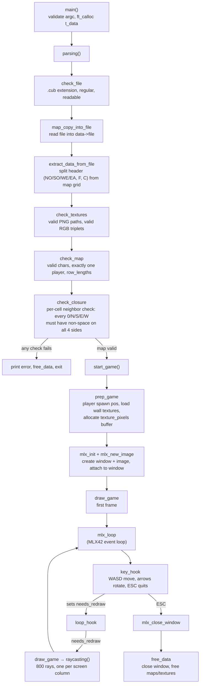

# cub3D

> A small 3D maze engine in C, inspired by *Wolfenstein 3D*. It reads a 2D text map and uses raycasting to render a first-person, textured 3D view of it in real time.

 

---

## Table of Contents

- [Overview](#overview)
- [How Raycasting Works Here](#how-raycasting-works-here)
- [Flow Chart](#flow-chart)
- [The `.cub` Map Format](#the-cub-map-format)
- [Controls](#controls)
- [Project Structure](#project-structure)
- [Getting Started](#getting-started)
- [Example Usage](#example-usage)
- [Status / Roadmap](#status--roadmap)
- [AI Usage](#ai-usage)
- [Resources](#resources)

---

## Overview

You give the program a `.cub` file describing a maze: wall textures, floor/ceiling colors, and a grid of walls and open space with a starting position. The program opens a window, drops you into the maze from that starting point, and lets you walk around and look at the textured walls — one vertical strip of pixels at a time, the same way the original Wolfenstein 3D did it, just without the 1992 hardware constraints.

Before any of that happens, the map file goes through a fairly strict parser: wrong extension, missing textures, malformed colors, holes in the walls, an unreachable player, tabs instead of spaces — all of it gets caught and reported before a window ever opens.

---

## How Raycasting Works Here

The core idea: for every vertical strip of pixels on screen, fire one ray from the player's position in a slightly different direction, see how far it travels before hitting a wall, and draw a wall slice whose height depends on that distance — closer wall, taller slice.

A few specifics from this implementation:

- **Player direction** is a vector (`dir_x`, `dir_y`), and there's a second **camera plane** vector perpendicular to it that defines the field of view. Rotating the player rotates both vectors using a standard 2D rotation matrix.
- **One ray per screen column.** With an 800px-wide window, that's 800 rays per frame, each offset slightly across the camera plane.
- **DDA (Digital Differential Analysis)** steps each ray one grid cell at a time — never checking sub-cell positions — until it lands on a `1` in the map grid. This is what `do_dda()` does: it compares how far the ray has to travel to cross the next vertical grid line vs. the next horizontal one, and steps in whichever direction is closer.
- **Fisheye correction.** A naive ray-to-wall distance produces a warped, "bulging" view, because rays at the edge of the FOV are naturally longer. Using the *perpendicular* distance from the camera plane (rather than the raw Euclidean ray length) removes that distortion.
- **Texture mapping.** Once a ray hits a wall, `pos_on_wall` (where exactly on that wall face it hit, from 0 to 1) picks out a texture column, and the wall slice is drawn by sampling that column of the appropriate PNG (`north`/`south`/`east`/`west`, chosen from which side of the wall the ray hit).

---

## Flow Chart



---

## The `.cub` Map Format

```
NO ./textures/north.png
SO ./textures/south.png
WE ./textures/west.png
EA ./textures/east.png

F 220,100,0
C 225,30,0

    1111111111111111
    1000000000000001
    1011000001110001
    1001000000000001
1111111111011000001110001
100000000011000000010001
101111111111111111110000001
1011000000000000000000001N1
1011000111111111111111111111
11111111
```

- `NO` / `SO` / `WE` / `EA` — PNG texture paths for the four wall orientations
- `F` / `C` — floor / ceiling color as an `R,G,B` triplet (0–255 each)
- Map grid: `0` open space, `1` wall, and exactly one of `N`/`S`/`E`/`W` marking the player's start position and facing direction
- Rows don't all need to be the same length — the parser tracks each row's real length separately (`row_lengths`) rather than assuming a rectangle
- Every open cell must be enclosed by walls on all four sides, or the map is rejected as having a hole

---

## Controls

| Key            | Action         |
|----------------|----------------|
| `W` / `↑`      | Move forward   |
| `S` / `↓`      | Move backward  |
| `A`            | Strafe left    |
| `D`            | Strafe right   |
| `←` / `→`      | Rotate camera  |
| `ESC` / window close | Quit    |

---

## Project Structure

```
42Cub3d/
├── Makefile
├── includes/
│   └── cub3d.h            # t_data, t_player, t_ray, t_texrgbinfo, all error messages
├── srcs/
│   ├── main.c               # argv check, parsing() pipeline, start_game()
│   ├── init_data.c           # zero-initializes t_data
│   ├── header.c                # prints the startup banner
│   ├── parsing/
│   │   ├── permission.c        # check_file: extension, regular file, readable
│   │   ├── map_copy.c            # reads the .cub file into memory
│   │   ├── extract_data.c         # splits header (textures/colors) from the map grid
│   │   ├── helps_to_extract.c      # per-line parsing helpers
│   │   ├── check_textures.c         # validates texture paths + RGB values
│   │   ├── check_map.c               # valid characters, single player, row_lengths
│   │   └── check_map_closure.c        # wall-hole detection (per-cell neighbor check)
│   ├── render/
│   │   ├── prep_game.c          # loads textures, allocates the pixel buffer, spawns player
│   │   ├── raycasting.c           # the per-column DDA loop + texture sampling
│   │   ├── draw_game.c              # pushes the pixel buffer to the MLX42 image
│   │   └── moving_n_keys.c           # key_hook / loop_hook: movement, rotation, collision
│   └── utils/
│       ├── error.c              # ft_error, print_err_msg
│       ├── free_data.c           # cleanup: window, maps, textures, pixel buffer
│       └── utils.c                # shared helpers
├── libft/                    # custom libc subset (strings, memory, lists, printf, get_next_line)
├── textures/                 # sample wall/floor/ceiling PNGs
└── maps/                     # valid + invalid test maps used during development
```

---

## Getting Started

### macOS prerequisite

MLX42 needs GLFW to build:

```sh
brew install glfw
```

### MLX42

The project depends on [MLX42](https://github.com/codam-coding-college/MLX42), a small cross-platform graphics library built on GLFW:

```sh
git clone https://github.com/codam-coding-college/MLX42.git
cd MLX42
cmake -B build
cmake --build build -j4
```

### Build & Run

```sh
make
./cub3d <path/to/map.cub>
```

---

## Example Usage

```sh
./cub3d maps/valid/simple.cub
```

Trying an invalid map prints a specific error instead of a crash — for example:

```sh
./cub3d maps/invalid/color_tests/test1.cub
# Error: At least one of R,G,B colours is out of range [0, 255]
```

---

## Status / Roadmap

- Mandatory part complete: parsing, validation, raycasting, textured walls, movement, rotation, clean exit
- **Minimap** (2D top-down view with player position) — planned, not yet implemented

---

## AI Usage

AI was used to help build the startup header/banner shown in the terminal on launch (controls + project name), not for the parsing or rendering logic.

---

## Resources

- [Raycasting in Cub3D — Medium tutorial](https://devabdilah.medium.com/3d-ray-casting-game-with-cub3d-7a116376056a)
- [Cub3D concepts writeup](https://mintlify.wiki/ibon-ira/Cub3d/introduction)
- [Permadi's Raycasting Tutorial](https://permadi.com/1996/05/ray-casting-tutorial-1/#INTRODUCTION)
- [Lode's Computer Graphics Tutorial — Raycasting](https://lodev.org/cgtutor/raycasting.html)
- [Map parsing & validation notes](https://hackmd.io/@nszl/H1LXByIE2#Map-parsing-and-validating)

---

[↑ Back to top](#cub3d)
