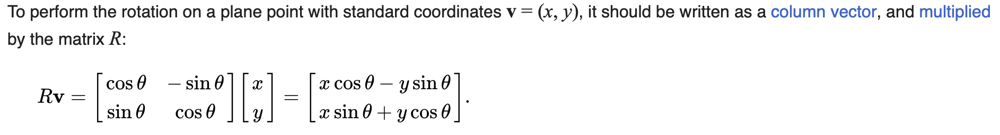

*This project has been created as part of the 42 curriculum by nkuydin, matnusko.*

# cub3D

## Installation Insctructions

### macOS prerequisite

GLFW is required to build MLX42. On macOS, install it through Homebrew:

```sh
brew install glfw
```

### MLX42

This project depends on [MLX42](https://github.com/codam-coding-college/MLX42), a simple cross-platform graphics library built on top of GLFW. Follow the official installation guide to set it up:

[MLX42 — Installation](https://github.com/codam-coding-college/MLX42#installation-%EF%B8%8F)

 - git clone https://github.com/codam-coding-college/MLX42.git
 - cd MLX42
 - cmake -B build # build here refers to the outputfolder.
 - cmake --build build -j4 # or do make -C build -j4

### Build

Once GLFW is installed and MLX42 is in place, build the project with:

```sh
make
```

### Usage

```sh
./cub3d <path/to/map.cub>
```

---

## Description

**cub3D** is a 42 school project inspired by the legendary *Wolfenstein 3D* — the game that pioneered the first-person shooter genre back in 1992. The goal is to build a small graphical engine in C that renders a 3D-looking maze from a 2D map description, using the **raycasting** technique.

Starting from a plain text file describing walls, floor, ceiling, textures and the player's spawn position, the program opens a window and immerses the player inside the maze. From there you can walk around, look at the textured walls, and explore — all rendered one vertical strip of pixels at a time, the same way id Software did it more than thirty years ago.

### Features

- Parsing of `.cub` map files with validation of map shape, characters, textures and colors
- Raycasting renderer producing a 3D perspective from a 2D grid
- Differently textured walls depending on their orientation (North, South, East, West)
- Configurable floor and ceiling colors
- Smooth player movement (`W`, `A`, `S`, `D`) and camera rotation (arrow keys)
- Clean window management — closing via the cross or `ESC` exits gracefully

### The `.cub` map format

A map file describes the scene through a small set of identifiers followed by the map grid itself:

```
NO ./textures/north.png
SO ./textures/south.png
WE ./textures/west.png
EA ./textures/east.png

F 220,100,0
C 225,30,0

	1111111111111111
	1000000000000001
	1011000001110001
	1001000000000001
1111111111011000001110001
100000000011000000010001
101111111111111111110000001
1011000000000000000000001N1
1011000111111111111111111111
11111111
```

- `NO`, `SO`, `WE`, `EA` — paths to the wall textures for each cardinal direction
- `F` and `C` — floor and ceiling colors as RGB triplets
- `0` walkable space, `1` wall, `N`/`S`/`E`/`W` player spawn and starting orientation

### Controls

| Key       | Action          |
|-----------|-----------------|
| `W`       | Move forward    |
| `S`       | Move backward   |
| `A`       | Strafe left     |
| `D`       | Strafe right    |
| `←` / `→` | Rotate camera   |
| `ESC`     | Quit            |

## Main Concepts

**"See kids, this is why you need to learn Pythagoras and trig at school. Those normal vectors won't calculate themselves ;-)"**

Vector describes how much of something there is and where it is going. Vector is used for representing the direction the player is currently facing. A vector in 2D coordinate system are usually considered to be X and Y components. V = (Vx, Vy);

RayCasting - technique that transform a limited form of data into a 3D projectionby tracing rays from the viewpoint into the viewing volume RayCasting is much faster than RayTracing. The first uses much smaller amount of a rays for a window than the second.

In raycasting, walls are always 90 degrees angle with the floor. Floor and ceiling are untextured. Thus, the viewpoint cannot be rotated along the Z axis. 

The following attributes needed before the world could be projected and rendered:
1. Player's height, player's field of view(FOV), and player's position.
2. Projection plane's dimension.
3. Relationship between player and projection plane.

The FOV determines how wide the player sees the world in front of him/her. We define FOV to be 60 degrees. The player's height is defined to be 32 units high. 

Point of view of the player is - the player's X and Y coordinates, and teh angle that the player is facing. 

The formula to calculate the length of ray is d = sqrt[(x2 - x1)^2 + (y2 - y1)^2];

Add rays to each other, between them is the angle in the radians equal to 60/win_width. And number of rays will be = win_width.

The height of the wall calculates depending on the length of the ray touching this wall. So, the smaller the ray, the bigger will be the wall. And vice versa.


For the determining the direction/angle the player is pointing to, which texture the player is currently looking at. We need to understand that the line is y = kx + b, where k = dy / dx.

Multiplying cos of the angle between two rays to the length of a single ray, to get rid of 'fish eye' thing. 


When the player rotates, the camera has to rotate, so both the direction vector and the plane vector have to be rotated. To rotate a vector, the rotation matrix from linear algebra has to be used. The matrix:

R = [cos θ  -sin θ]; [sin θ   cos θ]. Rotates points in the xy plan counterclockwise through an angle θ about the origin.



deltaDistX and deltaDistY are the distance the ray has to travel to go from 1 x-side to the next x-side, or from 1 y-side to the next y-side. Alright so delta here, is just the difference(length) between intersection of the line with one x-grid and the next one.

- deltaDistX = sqrt[(x2 - x1)^2 + (y2 - y1)^2];
- deltaDistY = 1;
- We want to know: how far does the ray travel to cross 1 unit in X. So (x2-x1) = 1:
- SO, deltaDistX = sqrt(1 + (y2 - y1)^2);
Now, slope of the line is (y2 - y1)/(x2 - x1). Since (x2-x1) = 1; slope = (y2 - y1)
- SO, deltadistX = sqrt(1 + (rayDirY / rayDirX)^2);
- OR, deltaDistX = sqrt(1 + (rayDirY^2 / rayDirX^2));
- deltaDistX = sqrt(rayDirX^2 / rayDirX^2 + rayDirY^2 / rayDirX^2);
- deltaDistX = sqrt((rayDirX^2 + rayDirY^2) / rayDirX^2);
- deltaDistX = sqrt(rayDirX^2 + rayDirY^2) / sqrt(rayDirX^2)
- deltadistX = sqrt(rayDirX^2 + rayDirY^2) / abs(rayDirX)
- deltaDistX = abs(1 / rayDirX)
- deltaDistY = abs(1 / rayDirY)

 - mapX + 1.0 - posX → "How far until I reach the next vertical grid line?"
 - deltaDistX → "How much ray length corresponds to 1 unit of X movement?"
 - sideDistX → "How far along the ray until I hit that vertical grid line?"

 if sideDistX smaller/lower than sideDistY
	we take one step/one unit in the x direction, to the x side/grid line
 else
	we take one step in the y direction, to the y side

ray->wall_x  is the point in the y axes or x axes depending on the value of the side, and it is calculated by moving from the initial position x or y by the wall dist multiplying to the dir x or y, to keep the right direction, and make sure that it finds the exact and true point intersection

## Resources


- [RayCasting in Cub3D Medium Tutorial](https://devabdilah.medium.com/3d-ray-casting-game-with-cub3d-7a116376056a)
- [Someone's Readme - Good for Concepts & Ideas](https://mintlify.wiki/ibon-ira/Cub3d/introduction)
- [Raycasting Tutorial. Good explanation](https://permadi.com/1996/05/ray-casting-tutorial-1/#INTRODUCTION)
- [Lode's Computer Graphics Tutorial - RayCasting](https://lodev.org/cgtutor/raycasting.html)
- [Someone's Cub3D Explanation](https://hackmd.io/@nszl/H1LXByIE2#Map-parsing-and-validating)
- [RayCasting Crazy Explanation in Russian Language](https://www.youtube.com/watch?v=XWCHl0rpBj4)
- [The Best Explanation for people who love visualise](https://www.youtube.com/watch?v=eOCQfxRQ2pY)